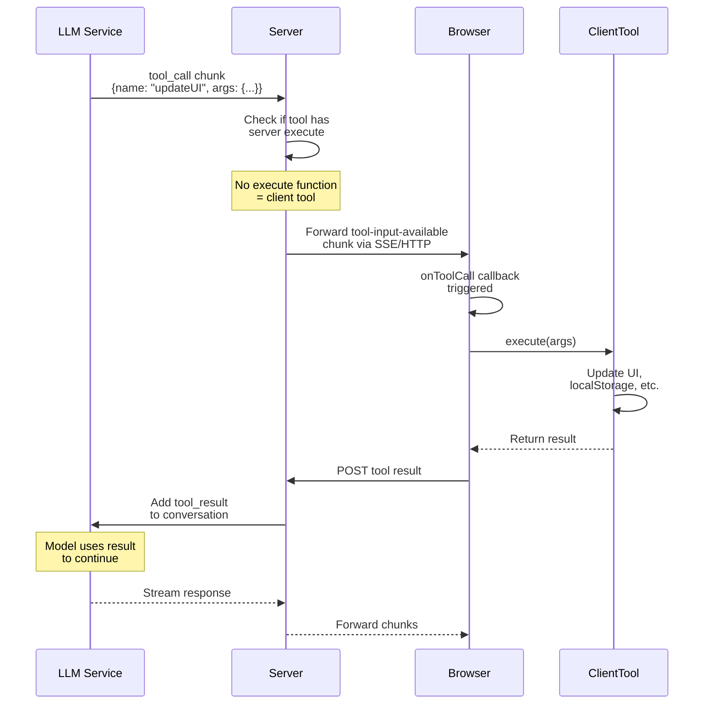

Client tools execute in the browser, enabling UI updates, local storage access, and browser API interactions. Unlike server tools, client tools don't have an `execute` function in their server definition.



## When to Use Client Tools

- **UI Updates**: Show notifications, update forms, toggle visibility
- **Local Storage**: Save user preferences, cache data
- **Browser APIs**: Access geolocation, camera, clipboard
- **State Management**: Update React/Vue/Solid state
- **Navigation**: Change routes, scroll to sections

## How It Works

1. **Tool Call from LLM**: LLM decides to call a client tool
2. **Server Detection**: Server sees the tool has no `execute` function
3. **Client Notification**: Server sends a `tool-input-available` chunk to the browser
4. **Client Execution**: Browser's `onToolCall` callback is triggered with:
   - `toolName`: Name of the tool to execute
   - `input`: Parsed arguments
5. **Result Return**: Client executes the tool and returns the result
6. **Server Update**: Result is sent back to the server and added to the conversation
7. **LLM Continuation**: LLM receives the result and continues the conversation

## Defining Client Tools

Client tools use the same `toolDefinition()` API but with the `.client()` method:

```typescript
// tools/definitions.ts - Shared between server and client
import { toolDefinition } from "@tanstack/ai";
import { z } from "zod";

export const updateUIDef = toolDefinition({
  name: "update_ui",
  description: "Update the UI with new information",
  inputSchema: z.object({
    message: z.string().describe("Message to display"),
    type: z.enum(["success", "error", "info"]).describe("Message type"),
  }),
  outputSchema: z.object({
    success: z.boolean(),
  }),
});

export const saveToLocalStorageDef = toolDefinition({
  name: "save_to_local_storage",
  description: "Save data to browser local storage",
  inputSchema: z.object({
    key: z.string().describe("Storage key"),
    value: z.string().describe("Value to store"),
  }),
  outputSchema: z.object({
    saved: z.boolean(),
  }),
});
```

## Using Client Tools

### Server-Side

To give the LLM access to client tools, pass the tool definitions (not implementations) to the server when creating the chat:

```typescript
// api/chat/route.ts
import { chat, toServerSentEventsStream } from "@tanstack/ai";
import { openai } from "@tanstack/ai-openai";
import { updateUIDef, saveToLocalStorageDef } from "@/tools/definitions";

export async function POST(request: Request) {
  const { messages } = await request.json();

  const stream = chat({
    adapter: openai(),
    messages,
    model: "gpt-4o",
    tools: [updateUIDef, saveToLocalStorageDef], // Pass definitions
  });

  return toServerSentEventsStream(stream);
}
```

### Client-Side

Create client implementations with automatic execution and full type safety:

```typescript
// app/chat.tsx
import { useChat, fetchServerSentEvents } from "@tanstack/ai-react";
import { 
  clientTools, 
  createChatClientOptions, 
  type InferChatMessages 
} from "@tanstack/ai-client";
import { updateUIDef, saveToLocalStorageDef } from "@/tools/definitions";
import { useState } from "react";

function ChatComponent() {
  const [notification, setNotification] = useState(null);

  // Step 1: Create client implementations
  const updateUI = updateUIDef.client((input) => {
    // Update React state - fully typed!
    setNotification({ message: input.message, type: input.type });
    return { success: true };
  });

  const saveToLocalStorage = saveToLocalStorageDef.client((input) => {
    localStorage.setItem(input.key, input.value);
    return { saved: true };
  });

  // Step 2: Create typed tools array (no 'as const' needed!)
  const tools = clientTools(updateUI, saveToLocalStorage);

  const chatOptions = createChatClientOptions({
    connection: fetchServerSentEvents("/api/chat"),
    tools,
  });

  // Step 3: Infer message types for full type safety
  type ChatMessages = InferChatMessages<typeof chatOptions>;

  const { messages, sendMessage, isLoading } = useChat(chatOptions);

  // Step 4: Render with full type safety
  return (
    <div>
      {messages.map((message) => (
        <MessageComponent key={message.id} message={message} />
      ))}
      {notification && (
        <div className={`notification ${notification.type}`}>
          {notification.message}
        </div>
      )}
    </div>
  );
}

// Messages component with full type safety
function MessageComponent({ message }: { message: ChatMessages[number] }) {
  return (
    <div>
      {message.parts.map((part) => {
        if (part.type === "text") {
          return <p>{part.content}</p>;
        }
        
        if (part.type === "tool-call") {
          // ✅ part.name is narrowed to specific tool names
          if (part.name === "update_ui") {
            // ✅ part.input is typed as { message: string, type: "success" | "error" | "info" }
            // ✅ part.output is typed as { success: boolean } | undefined
            return (
              <div>
                Tool: {part.name}
                {part.output && <span>✓ Success</span>}
              </div>
            );
          }
        }
      })}
    </div>
  );
}
```

## Automatic Execution

Client tools are **automatically executed** when the model calls them. No manual `onToolCall` callback needed! The flow is:

1. LLM calls a client tool
2. Server sends `tool-input-available` chunk to browser
3. Client automatically executes the matching tool implementation
4. Result is sent back to server
5. Conversation continues with the result

## Type Safety Benefits

The isomorphic architecture provides complete end-to-end type safety:

```typescript
messages.forEach((message) => {
  message.parts.forEach((part) => {
    if (part.type === "tool-call" && part.name === "update_ui") {
      // ✅ TypeScript knows part.name is literally "update_ui"
      // ✅ part.input is typed as { message: string, type: "success" | "error" | "info" }
      // ✅ part.output is typed as { success: boolean } | undefined
      
      console.log(part.input.message); // ✅ Fully typed!
      
      if (part.output) {
        console.log(part.output.success); // ✅ Fully typed!
      }
    }
  });
});
```

## Tool States
Client tools go through a small set of observable lifecycle states you can surface in the UI to indicate progress:

- `awaiting-input` — the model intends to call the tool but arguments haven’t arrived yet.
- `input-streaming` — the model is streaming the tool arguments (partial input may be available).
- `input-complete` — all arguments have been received and the tool is executing.
- `completed` — the tool finished; part.output contains the result (or error details).

Use these states to show loading indicators, streaming progress, and final success/error feedback. The example below maps each state to a simple UI message.

```typescript
function ToolCallDisplay({ part }: { part: ToolCallPart }) {
  if (part.state === "awaiting-input") {
    return <div>🔄 Waiting for arguments...</div>;
  }
  
  if (part.state === "input-streaming") {
    return <div>📥 Receiving arguments...</div>;
  }
  
  if (part.state === "input-complete") {
    return <div>✓ Arguments received, executing...</div>;
  }
  
  if (part.output) {
    return <div>✅ Tool completed successfully</div>;
  }
  
  return null;
}
```

## Hybrid Tools

Tools can be implemented for both server and client, enabling flexible execution:

```typescript
// Define once
const addToCartDef = toolDefinition({
  name: "add_to_cart",
  description: "Add item to shopping cart",
  inputSchema: z.object({
    itemId: z.string(),
    quantity: z.number(),
  }),
  outputSchema: z.object({
    success: z.boolean(),
    cartId: z.string(),
  }),
});

// Server implementation - Store in database
const addToCartServer = addToCartDef.server(async (input) => {
  const cart = await db.carts.create({
    data: { itemId: input.itemId, quantity: input.quantity },
  });
  return { success: true, cartId: cart.id };
});

// Client implementation - Update local wishlist
const addToCartClient = addToCartDef.client((input) => {
  const wishlist = JSON.parse(localStorage.getItem("wishlist") || "[]");
  wishlist.push(input.itemId);
  localStorage.setItem("wishlist", JSON.stringify(wishlist));
  return { success: true, cartId: "local" };
});

// Server: Pass definition for client execution
chat({ tools: [addToCartDef] }); // Client will execute

// Or pass server implementation for server execution
chat({ tools: [addToCartServer] }); // Server will execute
```

## Best Practices

- **Keep client tools simple** - Since client tools run in the browser, avoid heavy computations or large dependencies that could bloat your bundle size.
- **Handle errors gracefully** - Define clear error handling in your tool implementations and return meaningful error messages in your output schema.
- **Update UI reactively** - Use your framework’s state management (eg. React/Vue/Solid) to update the UI in response to tool executions.
- **Secure sensitive data** - Never store sensitive data (like API keys or personal info) in local storage or expose it via client tools.
- **Provide feedback** - Use tool states to inform users about ongoing operations and results of client tool executions (loading spinners, success messages, error alerts).
- **Type everything** - Leverage TypeScript and Zod schemas for full type safety from tool definitions to implementations to usage.

## Common Use Cases

- **UI Updates** - Show notifications, update forms, toggle visibility
- **Local Storage** - Save user preferences, cache data
- **Browser APIs** - Access geolocation, camera, clipboard
- **State Management** - Update React/Vue/Solid state
- **Navigation** - Change routes, scroll to sections
- **Analytics** - Track user interactions

## Next Steps

- [How Tools Work](./tools) - Deep dive into the tool architecture
- [Server Tools](./server-tools) - Learn about server-side tool execution
- [Tool Approval Flow](./tool-approval) - Add approval workflows for sensitive operations

