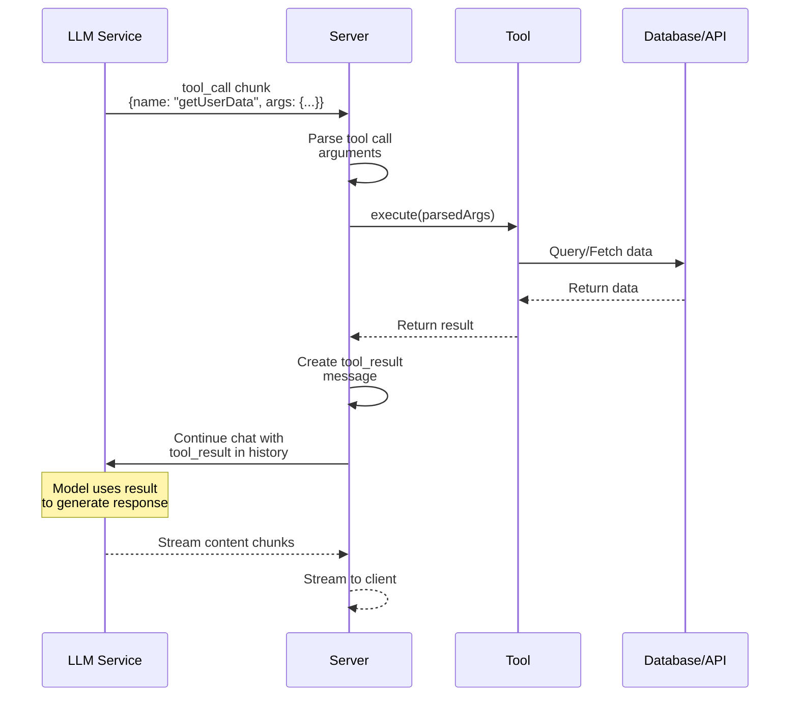

Server tools execute automatically when called by the LLM. They have full access to server resources like databases, APIs, and environment variables.



## How It Works

1. **Tool Call Received**: Server receives a `tool_call` chunk from the LLM
2. **Argument Parsing**: The tool arguments (JSON string) are parsed and validated against the input schema
3. **Execution**: The tool's `execute` function is called with the parsed arguments
4. **Result Processing**: The result is:
   - Validated against the output schema (if defined)
   - Converted to a tool result message
   - Added to the conversation history
5. **Continuation**: The chat continues with the tool result, allowing the LLM to generate a response based on the result
  
## Automatic vs. Manual Execution

**Automatic (Default):**
- Server tools with an `execute` function run automatically
- Results are added to the conversation immediately
- No client-side handling required

**Manual (Advanced):**
- You can handle tool calls manually by intercepting the stream
- Useful for custom orchestration or approval flows

## Server Tool Definition

```typescript
import { toolDefinition } from "@tanstack/ai";
import { z } from "zod";

const getUserDataDef = toolDefinition({
  name: "get_user_data",
  description: "Get user information from the database",
  inputSchema: z.object({
    userId: z.string().describe("The user ID to look up"),
  }),
  outputSchema: z.object({
    name: z.string(),
    email: z.string().email(),
    createdAt: z.string(),
  }),
});

const getUserData = getUserDataDef.server(async ({ userId }) => {
  // This runs on the server - secure access to database
  const user = await db.users.findUnique({ where: { id: userId } });
  return {
    name: user.name,
    email: user.email,
    createdAt: user.createdAt.toISOString(),
  };
});
```

## Defining Server Tools

Server tools use the isomorphic `toolDefinition()` API with the `.server()` method:

```typescript
import { toolDefinition } from "@tanstack/ai";
import { z } from "zod";

// Step 1: Define the tool schema
const getUserDataDef = toolDefinition({
  name: "get_user_data",
  description: "Get user information from the database",
  inputSchema: z.object({
    userId: z.string().describe("The user ID to look up"),
  }),
  outputSchema: z.object({
    name: z.string(),
    email: z.string().email(),
    createdAt: z.string(),
  }),
});

// Step 2: Create server implementation
const getUserData = getUserDataDef.server(async ({ userId }) => {
  // This runs on the server - can access database, APIs, etc.
  const user = await db.users.findUnique({ where: { id: userId } });
  return {
    name: user.name,
    email: user.email,
    createdAt: user.createdAt.toISOString(),
  };
});

// Example: API call tool
const searchProductsDef = toolDefinition({
  name: "search_products",
  description: "Search for products in the catalog",
  inputSchema: z.object({
    query: z.string().describe("Search query"),
    limit: z.number().optional().describe("Maximum number of results"),
  }),
});

const searchProducts = searchProductsDef.server(async ({ query, limit = 10 }) => {
  const response = await fetch(
    `https://api.example.com/products?q=${query}&limit=${limit}`,
    {
      headers: {
        Authorization: `Bearer ${process.env.API_KEY}`, // Server-only access
      },
    }
  );
  return await response.json();
});
```

## Using Server Tools

Pass tools to the `chat` method:

```typescript
import { chat, toStreamResponse } from "@tanstack/ai";
import { openai } from "@tanstack/ai-openai";
import { getUserData, searchProducts } from "./tools";

export async function POST(request: Request) {
  const { messages } = await request.json();

  const stream = chat({
    adapter: openai(),
    messages,
    model: "gpt-4o",
    tools: [getUserData, searchProducts],
  });

  return toStreamResponse(stream);
}
```

## Tool Organization Pattern

For better organization, define tool schemas and implementations separately:

```typescript
// tools/definitions.ts
import { toolDefinition } from "@tanstack/ai";
import { z } from "zod";

export const getUserDataDef = toolDefinition({
  name: "get_user_data",
  description: "Get user information",
  inputSchema: z.object({
    userId: z.string(),
  }),
  outputSchema: z.object({
    name: z.string(),
    email: z.string(),
  }),
});

export const searchProductsDef = toolDefinition({
  name: "search_products",
  description: "Search products",
  inputSchema: z.object({
    query: z.string(),
  }),
});

// tools/server.ts
import { getUserDataDef, searchProductsDef } from "./definitions";
import { db } from "@/lib/db";

export const getUserData = getUserDataDef.server(async ({ userId }) => {
  const user = await db.users.findUnique({ where: { id: userId } });
  return { name: user.name, email: user.email };
});

export const searchProducts = searchProductsDef.server(async ({ query }) => {
  const products = await db.products.search(query);
  return products;
});

// api/chat/route.ts
import { chat } from "@tanstack/ai";
import { openai } from "@tanstack/ai-openai";
import { getUserData, searchProducts } from "@/tools/server";

const stream = chat({
  adapter: openai(),
  messages,
  model: "gpt-4o",
  tools: [getUserData, searchProducts],
});
```

## Automatic Execution

Server tools are automatically executed when the model calls them. The SDK:

1. Receives the tool call from the model
2. Executes the tool's `execute` function
3. Adds the result to the conversation
4. Continues the chat with the tool result

You don't need to manually handle tool execution - it's automatic!

## Error Handling

Tools should handle errors gracefully:

```typescript
const getUserDataDef = toolDefinition({
  name: "get_user_data",
  description: "Get user information",
  inputSchema: z.object({
    userId: z.string(),
  }),
  outputSchema: z.object({
    name: z.string().optional(),
    email: z.string().optional(),
    error: z.string().optional(),
  }),
});

const getUserData = getUserDataDef.server(async ({ userId }) => {
  try {
    const user = await db.users.findUnique({ where: { id: userId } });
    if (!user) {
      return { error: "User not found" };
    }
    return { name: user.name, email: user.email };
  } catch (error) {
    return { error: "Failed to fetch user data" };
  }
});
```

## Best Practices

1. **Keep tools focused** - Each tool should do one thing well
2. **Validate inputs** - Use Zod schemas to ensure type safety
3. **Handle errors** - Return meaningful error messages
4. **Use descriptions** - Clear descriptions help the model use tools correctly
5. **Secure sensitive operations** - Never expose API keys or secrets to the client

## Next Steps

- [Client Tools](./client-tools) - Learn about client-side tool execution
- [Tool Approval Flow](./tool-approval) - Add approval workflows for sensitive operations
