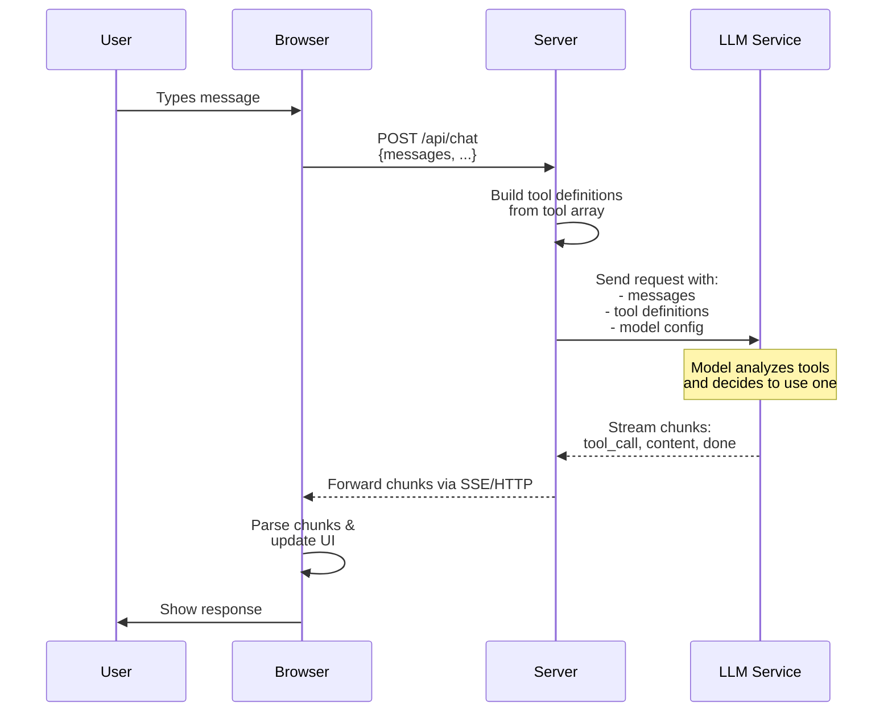
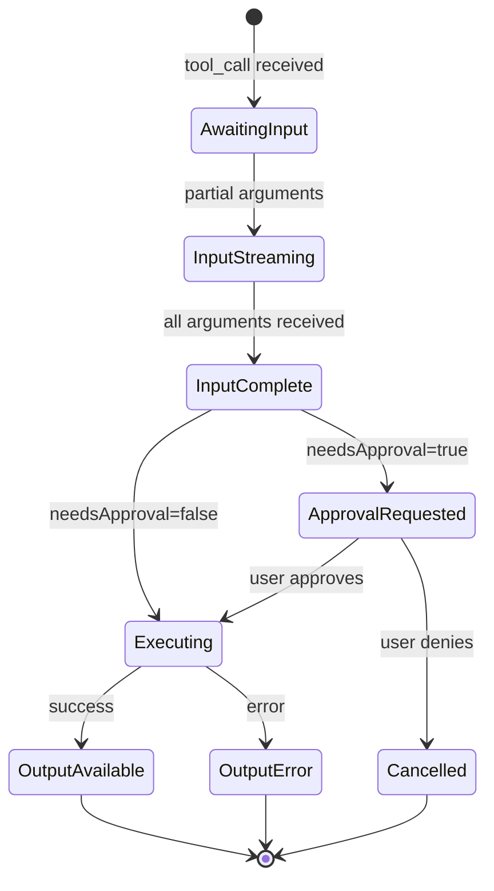
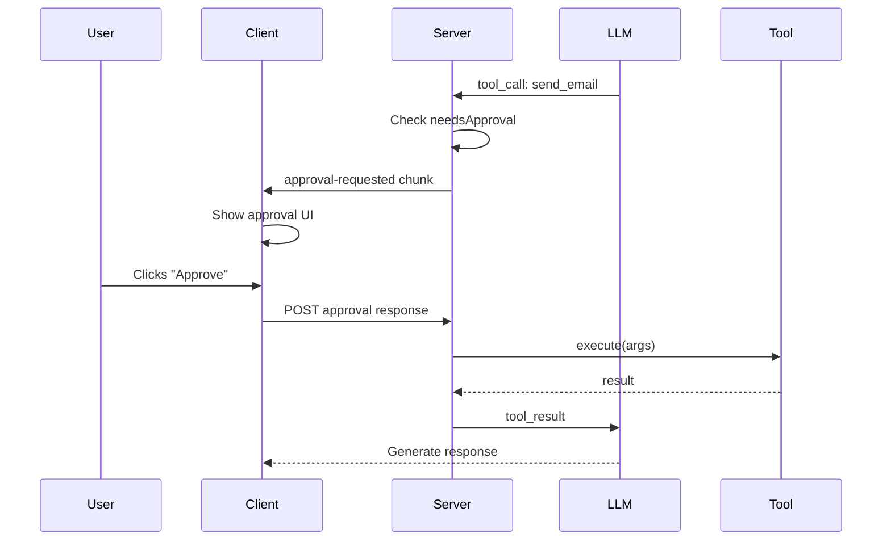
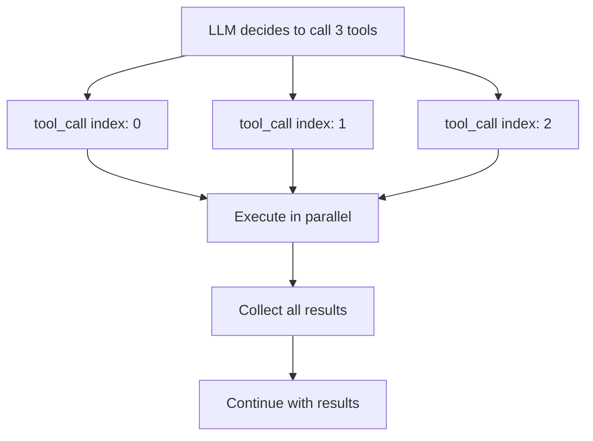

The TanStack AI tool system provides a powerful, flexible architecture for enabling AI agents to interact with external systems:

- [**Server Tools**](./server-tools) execute securely on the backend with automatic handling
- [**Client Tools**](./client-tools) execute in the browser for UI updates and local operations
- [**The Agentic Cycle**](./agentic-cycle) enables multi-step reasoning and complex workflows
- [**Tool States**](#call-states) provide real-time feedback and enable robust UIs
- [**Approval Flow**](#approval-flow) gives users control over sensitive operations
This architecture enables building sophisticated AI applications that can:

- Fetch data from APIs and databases
- Perform calculations and transformations
- Update UIs and manage state
- Execute multi-step workflows
- Require user approval for sensitive actions

## Call Flow: Client to LLM Service

When a user sends a message that requires tool usage, the following flow occurs:



### Step-by-Step Breakdown

1. **User Input**: The user types a message in the chat interface
2. **Client Request**: The browser sends a POST request to the server with:
   - Current conversation history (`messages`)
   - Optional data payload (`body`)
3. **Server Processing**: The server:
   - Receives the request
   - Extracts messages from the request body
   - Converts tool definitions into the LLM's expected format
   - Sends the request to the LLM service (OpenAI, Anthropic, etc.)
4. **LLM Decision**: The LLM service:
   - Analyzes the conversation and available tools
   - Decides whether to call a tool based on the user's request
   - Generates tool calls with arguments
5. **Streaming Response**: The LLM streams back chunks:
   - `tool_call` chunks with tool name and arguments
   - `content` chunks with text responses
   - `done` chunk when complete
6. **Client Updates**: The browser receives chunks and updates the UI in real-time

### Code Example

**Server (API Route):**

```typescript
import { chat, toStreamResponse } from "@tanstack/ai";
import { openai } from "@tanstack/ai-openai";
import { getWeather, sendEmail } from "./tools";

export async function POST(request: Request) {
  const { messages } = await request.json();

  // Create streaming chat with tools
  const stream = chat({
    adapter: openai(),
    messages,
    model: "gpt-4o",
    tools: [getWeather, sendEmail], // Tool definitions passed here
  });

  return toStreamResponse(stream);
}
```

**Client (React Component):**

```typescript
import { useChat, fetchServerSentEvents } from "@tanstack/ai-react";

function ChatComponent() {
  const { messages, sendMessage, isLoading } = useChat({
    connection: fetchServerSentEvents("/api/chat"),
  });

  return (
    <div>
      {messages.map((message) => (
        <div key={message.id}>{/* Render message */}</div>
      ))}
      <input onSubmit={(e) => sendMessage(e.target.value)} />
    </div>
  );
}
```

## States and Lifecycle

Tools progress through different states during their lifecycle. Understanding these states helps build robust UIs and debug tool execution.



### Call States

| State | Description | Client Action |
|-------|-------------|---------------|
| `awaiting-input` | Tool call received, no arguments yet | Show loading |
| `input-streaming` | Partial arguments being received | Show progress |
| `input-complete` | All arguments received | Ready to execute |
| `approval-requested` | Waiting for user approval | Show approval UI |
| `approval-responded` | User has approved/denied | Execute or cancel |

### Result States

| State | Description | Client Action |
|-------|-------------|---------------|
| `streaming` | Result being streamed (future feature) | Show progress |
| `complete` | Result is complete | Show result |
| `error` | Error occurred during execution | Show error message |

### Monitoring Tool States in React

```typescript
function ChatComponent() {
  const { messages } = useChat({
    connection: fetchServerSentEvents("/api/chat"),
  });

  return (
    <div>
      {messages.map((message) => (
        <div key={message.id}>
          {message.parts.map((part) => {
            if (part.type === "tool-call") {
              return (
                <div key={part.id} className="tool-status">
                  {/* Show state-specific UI */}
                  {part.state === "awaiting-input" && (
                    <div>🔄 Calling {part.name}...</div>
                  )}
                  {part.state === "input-streaming" && (
                    <div>📥 Receiving arguments...</div>
                  )}
                  {part.state === "input-complete" && (
                    <div>✓ Arguments ready</div>
                  )}
                  {part.state === "approval-requested" && (
                    <ApprovalUI part={part} />
                  )}
                </div>
              );
            }
            if (part.type === "tool-result") {
              return (
                <div key={part.toolCallId}>
                  {part.state === "complete" && (
                    <div>✓ Tool completed</div>
                  )}
                  {part.state === "error" && (
                    <div>❌ Error: {part.error}</div>
                  )}
                </div>
              );
            }
          })}
        </div>
      ))}
    </div>
  );
}
```

### Approval Flow

For sensitive operations, tools can require user approval before execution:



**Define tool with approval:**

```typescript
const sendEmailDef = toolDefinition({
  name: "send_email",
  description: "Send an email",
  inputSchema: z.object({
    to: z.string().email(),
    subject: z.string(),
    body: z.string(),
  }),
  needsApproval: true, // Requires user approval
});

const sendEmail = sendEmailDef.server(async ({ to, subject, body }) => {
  await emailService.send({ to, subject, body });
  return { success: true };
});
```

**Handle approval in client:**

```typescript
const { messages, addToolApprovalResponse } = useChat({
  connection: fetchServerSentEvents("/api/chat"),
});

// In your render:
{part.state === "approval-requested" && (
  <div>
    <p>Approve sending email to {part.arguments.to}?</p>
    <button
      onClick={() =>
        addToolApprovalResponse({
          id: part.approval.id,
          approved: true,
        })
      }
    >
      Approve
    </button>
    <button
      onClick={() =>
        addToolApprovalResponse({
          id: part.approval.id,
          approved: false,
        })
      }
    >
      Deny
    </button>
  </div>
)}
```

### Hybrid Tools (Server + Client)

Some tools need to execute in both environments:

```typescript
// Server: Fetch data from database
const fetchUserPrefsDef = toolDefinition({
  name: "fetch_user_preferences",
  description: "Get user preferences from server",
  inputSchema: z.object({
    userId: z.string(),
  }),
});

const fetchUserPreferences = fetchUserPrefsDef.server(async ({ userId }) => {
  const prefs = await db.userPreferences.findUnique({ where: { userId } });
  return prefs;
});

// Client: Apply preferences to UI
const applyPrefsDef = toolDefinition({
  name: "apply_preferences",
  description: "Apply user preferences to the UI",
  inputSchema: z.object({
    theme: z.string(),
    language: z.string(),
  }),
});

// On client, create client implementation
const applyPreferences = applyPrefsDef.client(async ({ theme, language }) => {
  // Update UI state with preferences
  document.body.className = theme;
  i18n.changeLanguage(language);
  return { applied: true };
});

// Usage: LLM can chain these together
// 1. Call fetchUserPreferences (server)
// 2. Call applyPreferences with the result (client)
```

### Parallel Tool Execution

The LLM can call multiple tools in parallel for efficiency:



**Example:**

```
User: "Compare the weather in NYC, SF, and LA"

LLM calls:
- get_weather({city: "NYC"}) [index: 0]
- get_weather({city: "SF"}) [index: 1]
- get_weather({city: "LA"}) [index: 2]

All execute simultaneously, then LLM generates comparison.
```

## Best Practices

### Tool Design

- **Single Responsibility**: Each tool should do one thing well
- **Clear Descriptions**: Help the LLM understand when to use the tool
- **Type Safety**: Use Zod schemas for input/output validation
- **Error Handling**: Return meaningful error messages, don't throw
- **Idempotency**: Tools should be safe to call multiple times

### Security

- **Server vs Client**: Put sensitive operations on the server
- **Approval Flow**: Use `needsApproval` for destructive actions
- **Input Validation**: Always validate tool inputs
- **Rate Limiting**: Implement rate limits for expensive tools
- **Audit Logs**: Log tool executions for debugging and security

### Performance

- **Caching**: Cache tool results when appropriate
- **Parallel Execution**: Enable parallel tool calls when possible
- **Streaming**: Use streaming for long-running operations
- **Timeouts**: Set timeouts for external API calls
- **Lazy Loading**: Load tools only when needed


## Next Steps

- [Tools Overview](./tools) - Basic tool concepts and examples
- [Server Tools](./server-tools) - Deep dive into server-side tools
- [Client Tools](./client-tools) - Deep dive into client-side tools
- [Tool Approval Flow](./tool-approval) - Implementing approval workflows
- [Stream Chunk Definitions](../protocol/chunk-definitions) - Understanding the streaming protocol

